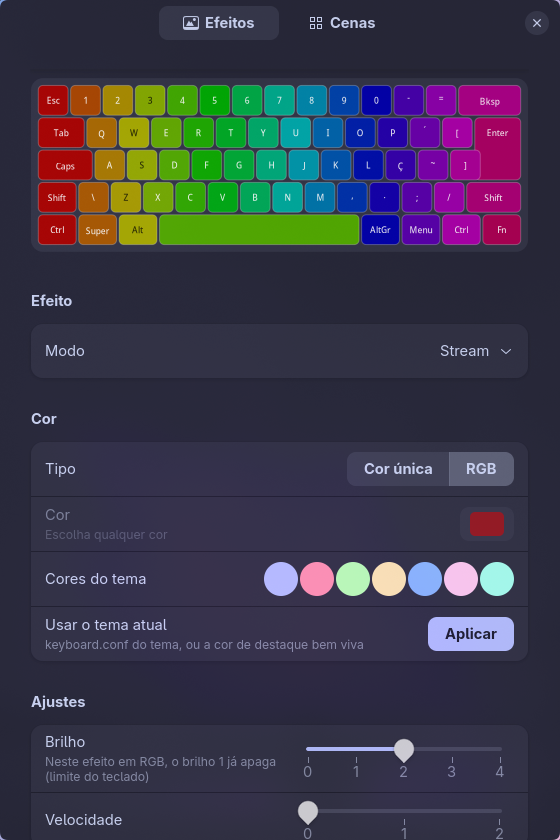
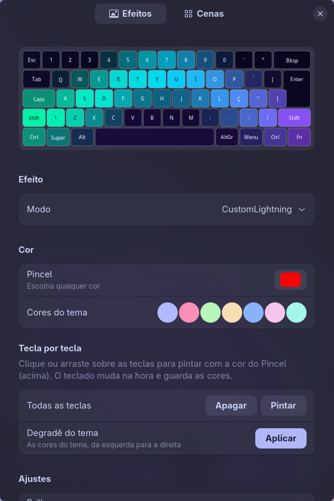
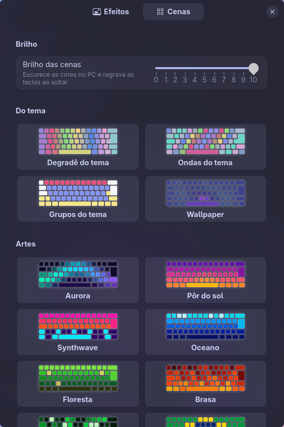

# OpenAurum

**Controle a iluminação RGB do teclado Pichau Aurum V60 no Linux.** Troque efeitos e cores, ajuste brilho e velocidade, pinte tecla por tecla e escolha entre mais de 40 cenas prontas, tudo sem precisar do Windows.

<p align="center">
  
  
  
</p>

> Projeto **não oficial**, feito pela comunidade, sem nenhum vínculo com a Pichau. "Pichau" e "Aurum" são marcas dos seus donos.
> *English summary at the end.*

---

## Sumário

- [Recursos](#recursos)
- [Seu teclado é compatível?](#seu-teclado-é-compatível)
- [Instalação](#instalação)
- [Como usar: o app](#como-usar-o-app)
- [Como usar: linha de comando](#como-usar-linha-de-comando)
- [Configuração opcional](#configuração-opcional)
- [Integração com o seu sistema (atalhos, temas, scripts)](#integração-com-o-seu-sistema)
- [Segurança: o que o OpenAurum faz (e não faz) com o teclado](#segurança)
- [Solução de problemas](#solução-de-problemas)
- [Atualizar e desinstalar](#atualizar-e-desinstalar)
- [Para desenvolvedores](#para-desenvolvedores)
- [Licença](#licença)
- [English summary](#english-summary)

---

## Recursos

- **Os 16 efeitos do teclado**: Static, Breath, Spin, ColorLoop, Stream, Bloom, UDWave, Cross, Rain, Meteor, TrigSpread, TrigSpread Reverse, TrigSingle, Sudoku, Tide e CustomLightning, além do LightOff (desligado).
- **Cor única ou RGB**: escolha qualquer cor com o seletor ou use as cores do seu tema.
- **Brilho de 0 a 10** com a cor única. O firmware ignora o próprio brilho nesse modo, então o OpenAurum ajusta a cor para você, com degraus calibrados a olho em cada efeito. Em RGB, o brilho usa os níveis 0-4 do próprio teclado. **Velocidade** de 0 a 2.
- **Tecla por tecla** (CustomLightning): clique ou arraste sobre o desenho do teclado para pintar. Também dá para pintar tudo ou aplicar um degradê do tema.
- **Cenas**: mais de 40 desenhos prontos para as teclas, em grupos: tema, wallpaper, arte, games, espaço, estações, Brasil e mundo, noturnas. Também guarda a sua própria pintura. As cenas têm **brilho de 0 a 10**.
- **Overlays automáticos**: zonas de cada dedo do Colemak-DH, destaque de WASD no modo de jogo e **mapa de calor** da digitação, que conta só quantas vezes cada tecla foi apertada (nunca o texto).
- **Modos de tela**: *Night* deixa as cenas mais quentes; *Cave* troca o teclado para um vermelho bem escuro e depois devolve tudo como estava.
- **Linha de comando completa** (`openaurum-cli`) para scripts, atalhos e troca de tema.
- **Cuidado com a memória do teclado**: só grava as teclas que mudaram, e mostra quantas gravações foram feitas (veja [Segurança](#segurança)).

## Seu teclado é compatível?

Testado no **Pichau Aurum V60**, que no USB aparece como `36ae:fe9c` (SDCINNOVATION). Para conferir:

```bash
lsusb | grep -i 36ae
# ... ID 36ae:fe9c SDCINNOVATION Gaming Keyboard
```

Se o seu mostra `36ae:fe9c`, é o mesmo teclado. Outros modelos (mesmo parecidos) **não são suportados**: o protocolo pode ser diferente, e o OpenAurum não manda nada para aparelhos que não conhece.

Funciona em qualquer distribuição Linux com **Python 3**, **GTK 4** e **libadwaita 1.4 ou mais nova**: Arch, Ubuntu 24.04+, Debian 13+, Fedora 40+, openSUSE Tumbleweed etc. A linha de comando só precisa do Python.

## Instalação

**1. Dependências** (só uma vez):

| Distribuição | Comando |
|---|---|
| Arch / Manjaro / EndeavourOS | `sudo pacman -S --needed git python-gobject gtk4 libadwaita python-evdev` |
| Ubuntu / Debian / Mint / Pop!_OS | `sudo apt install git python3-gi gir1.2-gtk-4.0 gir1.2-adw-1 python3-evdev` |
| Fedora | `sudo dnf install git python3-gobject gtk4 libadwaita python3-evdev` |
| openSUSE | `sudo zypper install git python3-gobject-Gdk typelib-1_0-Gtk-4_0 typelib-1_0-Adw-1 python3-evdev` |

O `python-evdev` só é usado pelo mapa de calor. Pode pular se não quiser esse recurso.

**2. Baixar e instalar:**

```bash
git clone https://github.com/its-danilo/openaurum.git
cd openaurum
./install.sh
```

Pronto: o **OpenAurum** aparece no menu de aplicativos. Se o app disser "sem acesso", desconecte e reconecte o teclado uma vez.

### O que o instalador faz

Tudo fica na sua pasta de usuário, e o `sudo` é usado **só** para a regra de permissão:

| Arquivo | Para quê |
|---|---|
| `~/.local/bin/openaurum`, `openaurum-cli`, `openaurum-heatmap` | os programas |
| `~/.local/share/openaurum/` | a biblioteca Python |
| `~/.local/share/applications/io.github.its_danilo.OpenAurum.desktop` + ícone | atalho no menu |
| `~/.config/systemd/user/openaurum-heatmap.service` | mapa de calor (vem **desligado**) |
| `/etc/udev/rules.d/70-openaurum.rules` (**sudo**) | deixa o seu usuário falar com o teclado, sem rodar nada como root |

Outras opções:

```bash
./install.sh --check      # só confere as dependências e se o teclado está conectado
./install.sh --no-udev    # instala sem sudo (você copia a regra udev depois, por conta própria)
./install.sh --uninstall  # remove tudo (veja abaixo)
```

> Se `~/.local/bin` não estiver no seu `PATH`, o instalador avisa. Adicione `export PATH="$HOME/.local/bin:$PATH"` ao `~/.bashrc` (ou ao arquivo equivalente do seu shell).

## Como usar: o app

Abra **OpenAurum** pelo menu (ou rode `openaurum`). São duas abas:

**Efeitos**
- **Modo**: escolha o efeito. O desenho do teclado no topo mostra como fica.
- **Cor**: *Cor única* ou *RGB*. O botão de cor abre um seletor, e a cor só é gravada quando você solta o mouse. Os círculos são as cores do seu tema; *Usar o tema atual* aplica a cor de destaque.
- **Ajustes**: Brilho e Velocidade.
- No **CustomLightning**, o desenho vira um editor: clique ou arraste para pintar com o *Pincel*. Tem também *Apagar/Pintar todas* e *Degradê do tema*.

**Cenas**
- **Brilho das cenas** (0-10), gravado quando você solta o controle.
- Clique numa cena para aplicá-la. *Minha pintura* guarda o que você pintou à mão.
- **Mapa de calor**: *Contar teclas digitadas* liga a contagem; *Mostrar no teclado* pinta as teclas do azul (pouco usada) ao vermelho (muito usada).
- **Automático**: escolha que eventos podem mudar o teclado (wallpaper, Colemak, modo de jogo, modos de tela).
- **Desligar cenas** volta ao efeito que estava antes.

## Como usar: linha de comando

```bash
openaurum-cli status                               # efeito, brilho, velocidade e cor atuais
openaurum-cli modes                                # lista os efeitos
openaurum-cli set --mode Breath --color '#00aaff' --brightness 7 --speed 1
openaurum-cli set --mode Tide --rgb --brightness 4  # RGB: brilho 0-4
openaurum-cli off                                  # desliga os LEDs (LightOff)
openaurum-cli theme                                # aplica a cor do tema (veja Configuração)

openaurum-cli scene list                           # cenas disponíveis
openaurum-cli scene aurora                         # aplica uma cena
openaurum-cli scene brightness 5                   # brilho das cenas, 0-10
openaurum-cli scene off                            # volta ao efeito anterior

openaurum-cli overlay game on                      # WASD e companhia acesos
openaurum-cli overlay colemak on                   # zonas dos dedos (Colemak-DH)
openaurum-cli overlay heat on                      # mapa de calor por cima da cena
openaurum-cli screen night                         # normal | night | cave
openaurum-cli writes                               # gravações por tecla (hoje / total)
```

Erros de comandos rodados em segundo plano ficam em `~/.local/state/openaurum/openaurum.log`.

## Configuração opcional

Nada é obrigatório. Para personalizar, crie `~/.config/openaurum/config.conf`:

```ini
# cores das cenas "Do tema" (a primeira é o destaque)
palette = #ff3c00, #ff0080, #0080ff
# imagem da cena "Wallpaper"
wallpaper = ~/Imagens/meu-wallpaper.jpg

# o que "openaurum-cli theme" (e o botão "Usar o tema atual") aplica
mode = Static
brightness = 10
speed = 1
color = #00aaff      # ou: rgb
```

## Integração com o seu sistema

O `openaurum-cli` foi feito para ser chamado por atalhos e scripts. Os comandos com `--auto` obedecem às chaves da seção *Automático* do app. Exemplos:

```bash
# ao trocar o tema/cor de destaque do seu desktop
openaurum-cli theme

# ao trocar de wallpaper (redesenha a cena "Wallpaper", se for a escolhida)
openaurum-cli event wallpaper

# um atalho de "modo de jogo"
openaurum-cli overlay game on --auto     # e: overlay game off --auto

# ao trocar o layout do teclado para Colemak-DH e de volta
openaurum-cli overlay colemak on --auto  # e: overlay colemak off --auto

# luz noturna / modo escuro total
openaurum-cli screen night               # cave | normal
```

Exemplo no Hyprland (`hyprland.conf`):

```ini
bind = SUPER CTRL, G, exec, openaurum-cli overlay game on --auto
bind = SUPER CTRL SHIFT, G, exec, openaurum-cli overlay game off --auto
```

> O OpenAurum nasceu dentro do **calOS** (dotfiles Arch + Hyprland do autor). Quando ele detecta um calOS, também lê a paleta e o wallpaper de lá. Veja [docs/CALOS.md](docs/CALOS.md).

## Segurança

O protocolo do teclado não é público. Ele foi **gravado** do app oficial da Pichau (Windows), observando o tráfego USB. A regra do projeto é simples:

- **Só são enviados comandos que o app oficial envia**, com valores dentro das faixas que ele usa. Nenhum comando é "adivinhado".
- **Nunca** são enviados o reset de fábrica nem a atualização de firmware.
- Os comandos só vão para a interface de iluminação do `36ae:fe9c`, e a regra udev só libera esse aparelho.

**Sobre a memória do teclado:** as cores de cada tecla e os ajustes ficam guardados na memória flash do teclado (sobrevivem a desconectar o cabo). Memória flash aguenta muitas, mas não infinitas, regravações. Por isso:

- As cenas **nunca são animadas** pelo PC. Os efeitos animados são os do próprio teclado.
- Só as teclas que mudaram são regravadas, e os controles gravam **quando você solta** (não enquanto arrasta).
- O app mostra o contador de gravações (`openaurum-cli writes` também).

Os detalhes técnicos estão em [docs/PROTOCOL.md](docs/PROTOCOL.md).

## Solução de problemas

**"Aurum V60 não encontrado"**: confira com `lsusb | grep 36ae`. Tente outra porta USB ou outro cabo.

**"Sem acesso ao teclado"**: a regra udev não está ativa. Rode `./install.sh` de novo (ou confira se `/etc/udev/rules.d/70-openaurum.rules` existe) e reconecte o teclado.

**"no reply from the keyboard"**: outro programa pode estar falando com o teclado ao mesmo tempo (dois apps abertos, por exemplo). O OpenAurum usa uma trava própria e repete o comando, mas feche outras ferramentas de RGB.

**O teclado para de responder depois de trocar de efeito**: em alguns sistemas, a outra interface USB do teclado (`36ae:feab`) trava. Adicione este parâmetro ao kernel e reinicie:
`usbhid.quirks=0x36ae:0xfe9c:0x400`

**O mapa de calor não conta**: precisa do `python-evdev` e de o seu usuário estar no grupo `input`: `sudo usermod -aG input $USER`, e depois saia e entre de novo na sessão.

**O app não abre (erro sobre `Adw` ou `Gtk`)**: sua distribuição precisa de GTK 4 e libadwaita 1.4+. Rode `./install.sh --check`. A linha de comando funciona mesmo sem eles.

## Atualizar e desinstalar

Atualizar:

```bash
cd openaurum
git pull
./install.sh
```

Desinstalar:

```bash
./install.sh --uninstall
```

Isso remove programas, biblioteca, atalho, ícone, serviço e regra udev. O instalador pergunta antes de apagar as suas cenas e configurações (`~/.local/state/openaurum`, `~/.config/openaurum`). As cores gravadas continuam no próprio teclado.

## Para desenvolvedores

Dá para rodar direto do repositório, sem instalar (só precisa da regra udev):

```bash
./bin/openaurum-cli status
./bin/openaurum
```

```
openaurum/
  protocol.py      comandos USB, efeitos, níveis de brilho, mapa das teclas
  scenes.py        cenas, overlays, modos de tela, brilho das cenas
  art.py           as cenas artísticas
  integrations.py  paleta, wallpaper e modo de tela (config.conf / calOS)
  paths.py         onde cada arquivo de estado fica
bin/               app (GTK 4), CLI e mapa de calor
data/              regra udev, atalho, ícone e serviço
docs/              protocolo e integração com o calOS
```

Contribuições são bem-vindas. Por favor, **não** envie pull requests com comandos USB que não tenham sido observados no app oficial (veja [Segurança](#segurança)).

## Licença

[GPL-3.0](LICENSE). Você pode usar, estudar, modificar e distribuir; versões modificadas distribuídas também precisam ser GPL-3.0.

---

## English summary

**OpenAurum** is an unofficial Linux tool for the lighting of the **Pichau Aurum V60** keyboard (USB `36ae:fe9c`). It is not affiliated with Pichau. It includes a GTK 4/libadwaita app (Portuguese UI), a CLI (`openaurum-cli`) and an optional typing-heatmap service. Features:

- all 16 built-in effects
- one color or RGB, with brightness 0-10 in one-color mode (the firmware ignores its own brightness byte there)
- per-key painting (CustomLightning)
- 40+ ready-made per-key scenes with their own brightness
- automatic overlays (Colemak-DH finger zones, game mode, typing heatmap)
- Night/Cave screen modes

**Install:** get Python 3 + PyGObject + GTK 4 + libadwaita ≥ 1.4 (see the table above), then `git clone https://github.com/its-danilo/openaurum.git && cd openaurum && ./install.sh`. Everything goes to `~/.local`. `sudo` is only used for a udev rule, which gives the logged-in user access to this one device. `./install.sh --uninstall` removes everything.

**Safety:** the protocol was recorded from the official Windows app, and only the commands that app sends are used. Factory reset and firmware update are never sent. Per-key colors live in the keyboard's flash, so nothing is animated from the PC and only changed keys are rewritten. See [docs/PROTOCOL.md](docs/PROTOCOL.md).

License: GPL-3.0.
